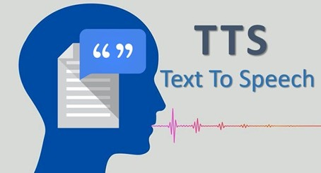
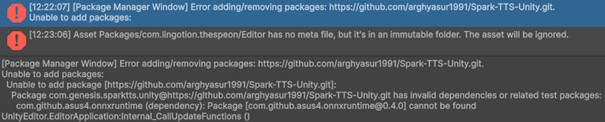
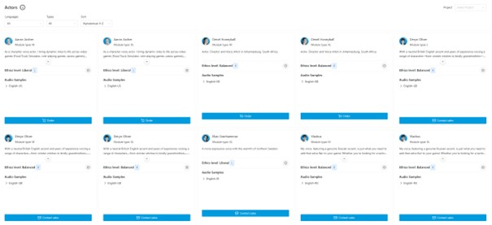
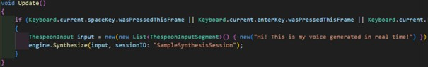
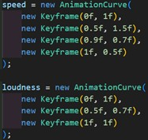
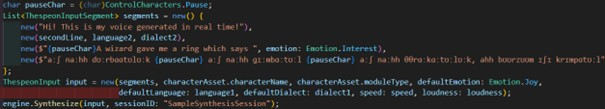
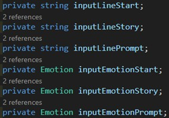

# Documentation Text-To-Speech

## For Dungeons and Doodles

### By Vincent Muller, March 16th 2026

## Table of contents

[Introduction](#introduction)

[Feature Summary](#feature-summary)

[Prototype](#prototype)

[Research](#research)

[Implementation](#implementation)

[Reflection](#reflection)

[Full Game](#full-game)

[Sources](#sources)

# Introduction

Text to speech. It's been everywhere lately, and for good reason. It allows people to hear text without having to read it, but for our game, it allows the player to be even more immersed into the different scenarios, making it one of the crucial types of AI-integration. Having a voice read out the different scenarios out loud with different emotions can really improve the overall feel of the game, which is why we wanted to implement it into our game.

In this document I will go over multiple topics regarding TTS, namely:

- What exactly we want to use TTS for
- Which TTS there are, which one we chose and why
- How it will be implemented

Another important thing to note is that we work with SCRUM, meaning that we work in sprints, each lasting around three weeks. The first sprint will be all about creating a prototype, meaning that we just want the TTS to be functional, so it's not necessary to have it fully fine-tuned right from the get-go.

# Feature Summary

For our game, want some type of TTS with which we can let our players hear the scenarios, instead of only reading them.

The documentation for this feature will be split up into two parts: the prototype and the full game.

# Prototype

## Research

To determine which TTS would be used for the prototype, we had to decide on how we want the TTS to run. We came to the conclusion that we preferably want a TTS that runs locally and is free, to make sure that there are no costs in implementing and running it.

Since the focus this sprint is more on getting a working prototype rather than having a fully fine-tuned feature, not much time was spent on finding the perfect option at this stage of our project.

After looking up locally running TTS models, one caught my eyes: Spark-TTS\[2\]. It's importable as a Unity Package, making it relatively easy to use in our project. However, when I tried importing it, some error appeared:

After spending some time trying to fix this unsuccessfully, it seemed more efficient to look for another model, which was when I came across Lingotion\[3\]. Lingotion is also a locally running TTS model, but it's less easy to implement than Spark-TTS. Lingotion requires the player to choose a voice themselves from their website:  

There are different options to consider when choosing, namely the accent, model size and even ethics levels.

Ethics levels are good to consider, but won't really make a difference in our game due to our game being very casual in that regard.

Model size is important to look at, due to there being a tradeoff between voice quality and performance cost. The bigger the model, the better it sounds, but also the more expensive it is on the device to run it. In this case, smaller models should be able to run on mobile devices, while the larger models require decent computer specifications. A smaller model will be sufficient for this prototype.

Then at last, the accent. There are a range of different accents to choose from, for which it is important to choose a relatively neutral sounding voice, resulting in the actor with the American accent being chosen.

## Implementation

Now onto the implementation of the TTS into our project. While importing the model, there was a choice to also import different example models, ranging from simple to advanced. The simple example model was pretty barebones, only requiring a text input:

The advanced example model seemed to be more what this project needed, being able to dictate speed and loudness, alongside other variables like language and dialect if applicable, but most importantly: emotion. Emotion is key in TTS, needing to be the right emotion in the right scenario to succeed in making the player immersed.

I then copied this example over to a new TTS class. In this class, I got rid of the example code and lines, and added a few new variables:

These variables seemed necessary to be able to dictate the scenario well. The start string and emotion will be used when entering the room to set the scene, then the story part will be about the main plot of that room, be it a puzzle or a trap or some enemies, while the prompt part will be focusing on telling the players what to draw. Separating the scenario into these three parts will make it easier to fine-tune the TTS or generated story if needed.

## Reflection

The implementation of the Lingotion TTS into our project went well, with the integration and possible adjustments being not too difficult. However, we came to notice that the voice would sometimes sound a bit weird, which we also shortly discussed with the product owner. We both ended up agreeing on that this was sufficient for the prototype, but that it would be better (if possible) to get a more realistic sounding TTS when polishing the game.

That's also what the second part of this documentation will be about: looking for ways to possibly fine-tune this one to make it sound better, or look for a better model. This part of the documentation will thus be completed at a later stage in our project's life cycle.

# Full Game

Not yet started on documentation for this part of the TTS.

# Sources

\[1\] "Swift Text-To-Speech tool as deep as possible," _ITNEXT_, Feb. 14, 2019. <https://itnext.io/swift-avfoundation-framework-text-to-speech-tool-f3e3bfc7ecf7> \[Accessed 10-3-2026\]

\[2\] Arghyasur, "Spark-TTS-Unity: Unity package for using Spark-TTS on-device models." _GitHub_, <https://github.com/arghyasur1991/Spark-TTS-Unity> \[Accessed on 10-3-2026\]

\[3\] "Lingotion," _GitHub_. <https://github.com/Lingotion> \[Accessed on 10-3-2026\]